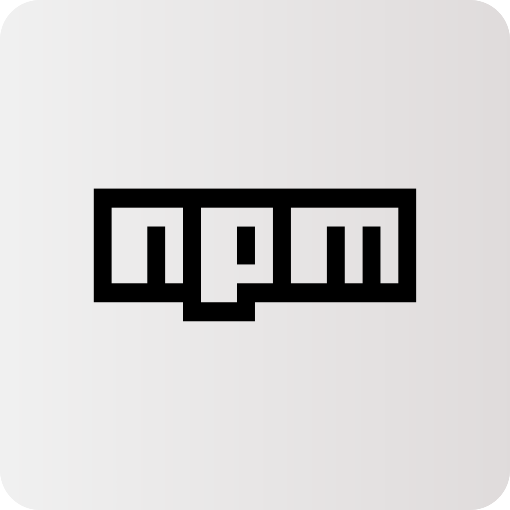

    
    <h1>Barudak Rosul</h1>
    
Komunitas Barudak Masjid di SMA Negeri 22 Garut

    <h2>Bahasa Pemrograman</h2>
    <picture>
        <source srcset="./images/icons/javascript-dark.svg" media="(prefers-color-scheme: dark)">
        <source srcset="./images/icons/javascript-light.svg" media="(prefers-color-scheme: light)">
        
    </picture>
    &nbsp;
    <picture>
        <source srcset="./images/icons/typescript-dark.svg" media="(prefers-color-scheme: dark)">
        <source srcset="./images/icons/typescript-light.svg" media="(prefers-color-scheme: light)">
        
    </picture>
    &nbsp;
    <picture>
        <source srcset="./images/icons/bash-dark.svg" media="(prefers-color-scheme: dark)">
        <source srcset="./images/icons/bash-light.svg" media="(prefers-color-scheme: light)">
        
    </picture>
    &nbsp;
    <picture>
        <source srcset="./images/icons/python-dark.svg" media="(prefers-color-scheme: dark)">
        <source srcset="./images/icons/python-light.svg" media="(prefers-color-scheme: light)">
        
    </picture>
     
    <h2>Developer</h2>
    <picture>
        <source srcset="./images/icons/npm-dark.svg" media="(prefers-color-scheme: dark)">
        <source srcset="./images/icons/npm-light.svg" media="(prefers-color-scheme: light)">
        
    </picture>
    &nbsp;
    <picture>
        <source srcset="./images/icons/pypi-dark.svg" media="(prefers-color-scheme: dark)">
        <source srcset="./images/icons/pypi-light.svg" media="(prefers-color-scheme: light)">
        
    </picture>

